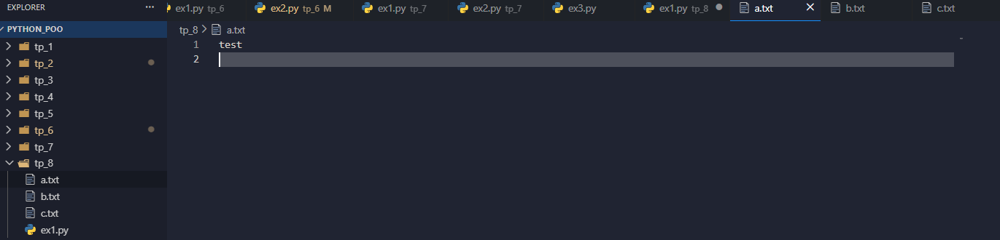
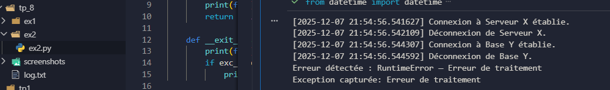
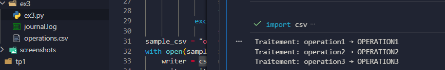

TP 8 – Gestion de Contexte Avancée en Python
---

### Exercice 1 – Gestion manuelle et avancée de fichiers

#### Objectif
Comprendre comment utiliser et implémenter des **gestionnaires de contexte** en Python avec les méthodes `__enter__` et `__exit__`, ainsi que les outils du module `contextlib`, pour la gestion de fichiers, connexions ou verrous.

#### Description
- **Partie 1** : Création d’une classe `TempFileWriter` qui écrit dans un fichier temporaire et le supprime automatiquement à la sortie du bloc `with`.  
- **Partie 2** : Réécriture de l’exemple avec un **générateur décoré `@contextmanager`** pour simplifier la syntaxe.  
- **Partie 3** : Utilisation de **ExitStack** pour ouvrir plusieurs fichiers et garantir leur fermeture correcte même en cas d’erreur.

#### Fonctionnalités
- Gestion automatique de la création et suppression de fichiers temporaires.  
- Utilisation de `contextlib.contextmanager` pour simplifier les gestionnaires de contexte.  
- Gestion de multiples ressources avec `ExitStack` garantissant la fermeture sécurisée.  

---

### Exercice 2 – Connexion et journalisation automatisée

#### Objectif
Approfondir la maîtrise des gestionnaires de contexte pour gérer simultanément des ressources externes (connexion simulée à un serveur) et des fichiers de log.

#### Description
- **Partie 1** : Classe `ConnectionManager` simulant une connexion à un service avec journalisation automatique des connexions et déconnexions.  
- **Partie 2** : Composition avec `ExitStack` pour ouvrir simultanément un fichier de log et une connexion distante.  
- **Partie 3** : Simulation d’une exception dans le bloc pour vérifier que toutes les ressources sont fermées correctement.

#### Fonctionnalités
- Gestion automatique de la connexion et déconnexion à un service.  
- Journalisation des actions dans un fichier `log.txt`.  
- Sécurité et fermeture des ressources même en cas d’erreur.  

---

### Exercice 3 – BatchProcessor pour traitement CSV

#### Objectif
Créer un gestionnaire de contexte capable de gérer simultanément un fichier d’opérations et un fichier de journalisation, garantissant la fermeture correcte des deux ressources même en cas d’exception.

#### Description
- Classe `BatchProcessor` ouvrant un fichier CSV contenant une liste d’opérations.  
- Traitement simulé de chaque ligne avec affichage ou transformation.  
- Journalisation automatique des débuts et fins de traitement dans `journal.log`.  
- Gestion sécurisée des fichiers pour éviter toute fuite de ressources.

#### Fonctionnalités
- Lecture et traitement des opérations depuis un fichier CSV.  
- Journalisation complète du début et de la fin des traitements.  
- Fermeture automatique et sécurisée des fichiers même en présence d’erreurs.  

---
